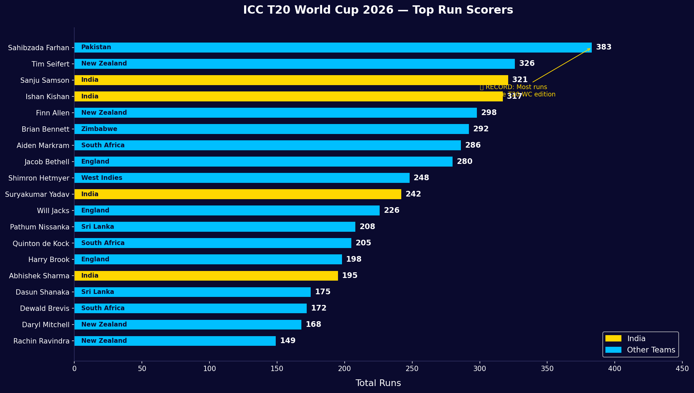
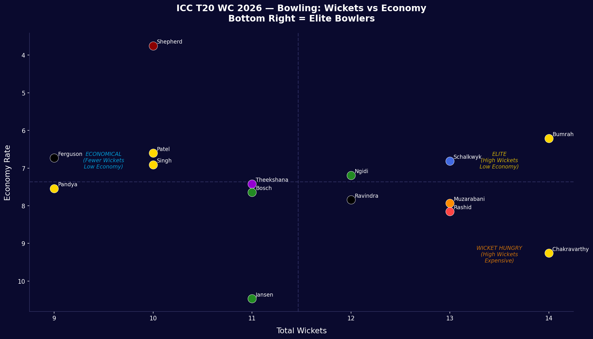
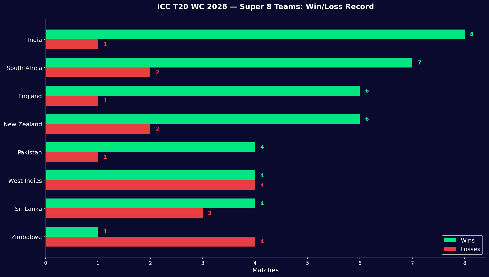
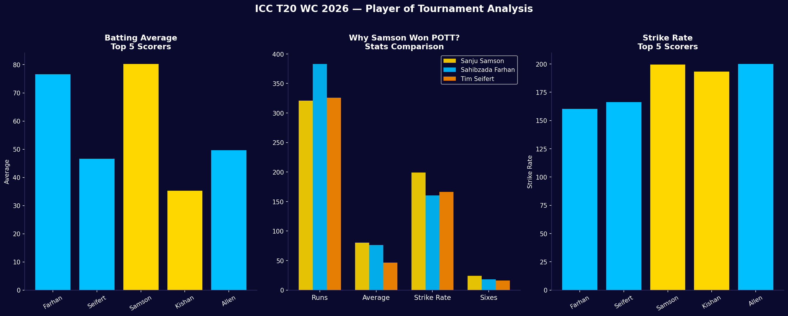
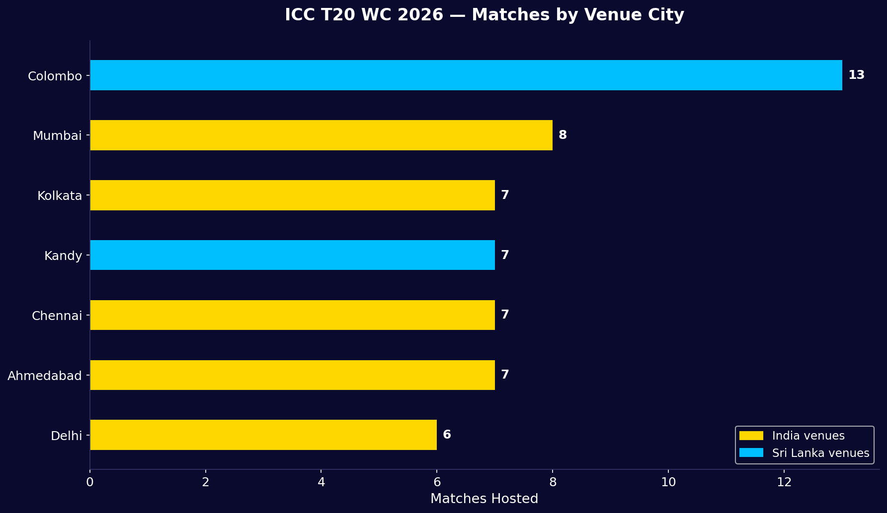

# 🏆 ICC T20 World Cup 2026 — Broadcast Analytics

## Overview
Broadcast-style sports analytics project analyzing the ICC Men's 
T20 World Cup 2026 — co-hosted by India & Sri Lanka (Feb–Mar 2026).

Built to mirror the kind of data-led insights used by sports 
broadcast teams like JioStar, Star Sports, and ESPNcricinfo 
during live coverage.

## Tournament Snapshot
- 20 teams | 55 matches | 8 venues
- Winner: India 🇮🇳 (first team to defend T20 WC title)
- Final: India 255/5 beat New Zealand by 96 runs

## Key Broadcast Insights Uncovered

### Batting
- Sahibzada Farhan (PAK) — 383 runs, RECORD for single edition
- Sanju Samson won Player of Tournament despite playing 
  only 5 matches — his 199.38 strike rate explains why
- Finn Allen hit the fastest century in T20 WC history — 33 balls

### Bowling  
- Bumrah & Varun Chakravarthy — joint leading wicket takers (14)
- USA's Shadley van Schalkwyk — 13 wickets in just 4 matches
  (most lethal per match — the hidden story of the tournament)
- Romario Shepherd — best figures 5/20 but low economy 
  tells a different story

### Data Quality Finding
- Attempted toss impact analysis but identified selection bias —
  toss data only recorded for certain matches making sample 
  unrepresentative. Flagged as limitation rather than 
  presenting misleading broadcast stat.
  
### Venues
- Colombo hosted 13 matches — most of any single city
- India's Final at Narendra Modi Stadium — world's largest 
  cricket ground — fitting for defending champions

## Broadcast-Style Visuals
All charts designed with dark navy background and bold colors 
to mirror TV broadcast graphics style.

## Tools Used
| Tool | Purpose |
|------|---------|
| Python (Pandas) | Data processing & analysis |
| Matplotlib & Seaborn | Broadcast-style visualizations |
| Power BI | Interactive dashboard |
| GitHub | Version control & portfolio |

## Data Sources
ESPNcricinfo, ICC official website, Wikipedia
Tournament concluded: March 8, 2026
